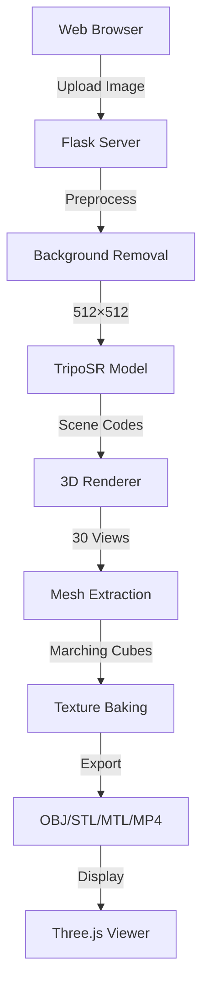

<div align="center">

# 🎨 TripoSR 3D Reconstruction

### Transform 2D Images into Interactive 3D Models with AI

[](https://opensource.org/licenses/MIT)
[](https://www.python.org/downloads/)
[](https://pytorch.org/)
[](https://flask.palletsprojects.com/)

[Demo](#-demo) • [Features](#-features) • [Installation](#-installation) • [Usage](#-usage) • [API](#-api) • [Documentation](#-documentation)


</div>

---

## 🚀 Overview

**TripoSR 3D Reconstruction** is a powerful AI-powered system that converts single 2D images into fully-formed 3D models. Built on Stability AI's TripoSR architecture, it combines cutting-edge deep learning with real-time web visualization to deliver production-ready 3D assets.

### What You Get

From a single photograph, generate:

| Output | Description |
|--------|-------------|
| **🎨 Textured 3D Model** | Complete OBJ file with UV-mapped textures |
| **🖨️ 3D Print Ready** | STL format optimized for manufacturing |
| **🎬 360° Video** | MP4 rotation animation (30 FPS) |
| **🖼️ Render Frames** | 30 individual PNG frames from multiple angles |
| **💻 Web Viewer** | Interactive Three.js visualization |

---

## ✨ Features

<table>
<tr>
<td width="50%">

### 🤖 AI-Powered
- **TripoSR Neural Network** - Transformer-based architecture
- **Automatic Background Removal** - U²-Net segmentation
- **Smart Preprocessing** - Intelligent image optimization
- **GPU Accelerated** - CUDA support for 10x speedup

</td>
<td width="50%">

### 🎯 Production Ready
- **Multiple Export Formats** - OBJ, STL, MTL, PNG
- **High-Quality Textures** - 1024×1024 UV-mapped textures
- **Real-time Progress** - Server-Sent Events streaming
- **REST API** - Full programmatic access

</td>
</tr>
</table>

---

## 📸 Demo

<div align="center">

### Input → Processing → Output

<table>
<tr>
<td align="center" width="33%">

<br><b>1. Upload Image</b>
<br>Any JPG/PNG
</td>
<td align="center" width="33%">

<br><b>2. AI Processing</b>
<br>10-30 seconds
</td>
<td align="center" width="33%">

<br><b>3. 3D Model</b>
<br>Ready to use
</td>
</tr>
</table>

</div>

---

## 🏗️ Architecture



### Technology Stack

<table>
<tr>
<td><b>Backend</b></td>
<td>
<code>Flask</code> • 
<code>PyTorch</code> • 
<code>NumPy</code> • 
<code>Trimesh</code> • 
<code>Rembg</code> • 
<code>Pillow</code>
</td>
</tr>
<tr>
<td><b>AI Model</b></td>
<td>
<code>TripoSR</code> • 
<code>U²-Net</code> • 
<code>Transformer</code> • 
<code>NeRF-style Rendering</code>
</td>
</tr>
<tr>
<td><b>Frontend</b></td>
<td>
<code>Three.js</code> • 
<code>Bootstrap 5</code> • 
<code>Font Awesome</code> • 
<code>WebGL</code>
</td>
</tr>
<tr>
<td><b>Formats</b></td>
<td>
<code>OBJ</code> • 
<code>STL</code> • 
<code>MTL</code> • 
<code>PNG</code> • 
<code>MP4</code>
</td>
</tr>
</table>

---

## ⚡ Performance

<div align="center">

| Stage | GPU (RTX 3090) | CPU (16-core) | Memory |
|-------|----------------|---------------|--------|
| **Background Removal** | 1-2s | 3-5s | 500 MB |
| **AI Inference** | 2-5s | 20-40s | 2 GB |
| **3D Rendering** | 3-8s | 30-60s | 1 GB |
| **Mesh Extraction** | 2-4s | 5-10s | 500 MB |
| **Total Pipeline** | **10-30s** | **60-120s** | **4-5 GB** |

</div>

---

## 📦 Installation

### Quick Start

```bash
# Clone repository
git clone https://github.com/sou-goog/AI-Powered-3D-Reconstruction-System.git
cd AI-Powered-3D-Reconstruction-System

# Install dependencies
pip install -r requirements.txt

# Run application
python app.py
```

### Docker (Recommended)

```bash
docker build -t triposr-3d .
docker run -p 5000:5000 --gpus all triposr-3d
```

### System Requirements

<table>
<tr>
<td width="50%">

**Minimum**
- Python 3.8+
- 8 GB RAM
- 10 GB disk space
- CPU with 4+ cores

</td>
<td width="50%">

**Recommended**
- Python 3.10+
- 16 GB RAM
- 20 GB disk space
- NVIDIA GPU (8+ GB VRAM)
- CUDA 11.8+

</td>
</tr>
</table>

---

## 🎮 Usage

### Web Interface

1. **Start the server:**
```bash
python app.py
```

2. **Open browser:**
```
http://localhost:5000
```

3. **Upload & Generate:**
   - Drag & drop your image
   - Watch real-time progress
   - Download 3D files

### Command Line

```bash
python run.py input.jpg --output ./output --device cuda
```

**Options:**
```
--device       GPU device (cuda/cpu)
--output       Output directory
--no-bg-remove Skip background removal
--resolution   Grid resolution (default: 256)
```

### Python API

```python
from tsr.system import TSR
from PIL import Image

# Load model
model = TSR.from_pretrained("stabilityai/TripoSR")
model.to("cuda")

# Process image
image = Image.open("input.jpg")
scene_codes = model([image], device="cuda")

# Extract mesh
mesh = model.extract_mesh(scene_codes)[0]
mesh.export("output.obj")
```

---

## 🔌 REST API

### Upload & Process

```http
POST /
Content-Type: multipart/form-data

{
  "image": <file>
}
```

### Progress Stream (SSE)

```http
GET /progress/{session_id}
Accept: text/event-stream
```

**Response:**
```javascript
data: {"message": "🎭 Removing background...", "timestamp": "12:34:56"}
data: {"message": "🧠 Running AI model...", "step": 2, "total": 5}
data: {"status": "complete", "folder_id": "1234567890"}
```

### Download Files

```http
GET /output/{folder_id}/mesh.obj
GET /output/{folder_id}/mesh.stl
GET /output/{folder_id}/mesh_texture.png
GET /output/{folder_id}/render.mp4
```

---

## 📊 Model Details

### TripoSR Architecture

```
Input Image (512×512×3)
    ↓
Image Tokenizer (CNN + ResBlocks)
    ↓
Transformer Backbone (12 layers)
    ├─ Self-Attention
    └─ Cross-Attention with Image
    ↓
TriPlane Decoder (3×256×256×64)
    ├─ XY Plane
    ├─ XZ Plane  
    └─ YZ Plane
    ↓
Volume Rendering (NeRF-style)
    ↓
3D Mesh Output
```

**Key Features:**
- **Training Data:** 800k+ objects from Objaverse
- **Architecture:** Transformer-based triplane representation
- **Rendering:** NeRF-inspired volume rendering
- **Mesh Extraction:** Marching Cubes algorithm
- **Model Size:** ~1.5 GB

---

## 📁 Output Format

Each processed image generates a folder with:

```
output/
└── 1234567890/
    ├── input.png              # Preprocessed input (512×512)
    ├── mesh.obj               # 3D geometry with UV mapping
    ├── mesh.stl               # 3D printing format
    ├── mesh.mtl               # Material definition
    ├── mesh_texture.png       # Color texture (1024×1024)
    ├── render.mp4             # 360° rotation video
    └── render_000-029.png     # Individual render frames
```

---

## 🛠️ Advanced Configuration

### Custom Model Parameters

```python
# Adjust rendering quality
model.renderer.set_chunk_size(8192)  # GPU memory vs quality

# Mesh resolution
mesh = model.extract_mesh(
    scene_codes,
    resolution=256,      # 128/256/512
    threshold=0.0,       # Surface threshold
    has_vertex_color=True
)
```

### Environment Variables

```bash
export CUDA_VISIBLE_DEVICES=0        # Select GPU
export PYTORCH_CUDA_ALLOC_CONF=max_split_size_mb:512
export FLASK_ENV=production
```

---

## 📚 Documentation

- **[Architecture Deep Dive](./docs/ARCHITECTURE.md)** - Detailed system design
- **[API Reference](./docs/API.md)** - Complete API documentation  
- **[Model Guide](./docs/MODEL.md)** - TripoSR model internals
- **[Deployment](./docs/DEPLOYMENT.md)** - Production deployment guide

---

## 🤝 Contributing

We welcome contributions! Here's how:

1. **Fork** the repository
2. **Create** a feature branch (`git checkout -b feature/amazing-feature`)
3. **Commit** your changes (`git commit -m 'Add amazing feature'`)
4. **Push** to the branch (`git push origin feature/amazing-feature`)
5. **Open** a Pull Request

### Development Setup

```bash
# Install dev dependencies
pip install -r requirements-dev.txt

# Run tests
pytest tests/

# Format code
black .
isort .
```

---

## 🐛 Troubleshooting

<details>
<summary><b>CUDA Out of Memory</b></summary>

```python
# Reduce chunk size
model.renderer.set_chunk_size(4096)  # Default: 8192

# Or use CPU
model.to("cpu")
```
</details>

<details>
<summary><b>Background Removal Slow</b></summary>

```bash
# Download U²-Net model manually
wget https://github.com/danielgatis/rembg/releases/download/v0.0.0/u2net.onnx
mkdir -p ~/.u2net
mv u2net.onnx ~/.u2net/
```
</details>

<details>
<summary><b>Port Already in Use</b></summary>

```bash
# Change port
python app.py --port 8000
```
</details>

---

## 📈 Roadmap

- [x] Basic 3D reconstruction
- [x] Web interface
- [x] Texture baking
- [x] Multiple export formats
- [x] Real-time progress updates
- [ ] Batch processing
- [ ] Multi-object scenes
- [ ] PBR material export
- [ ] Cloud deployment
- [ ] Mobile app

---

## 🌟 Showcase

<div align="center">

### Community Creations

*Share your 3D reconstructions! Open an issue with the `showcase` label.*

</div>

---

## 📄 License

This project is licensed under the **MIT License** - see the [LICENSE](LICENSE) file for details.

### Third-Party Licenses
- **TripoSR Model:** [Stability AI License](https://github.com/Stability-AI/TripoSR)
- **Three.js:** [MIT License](https://github.com/mrdoob/three.js/blob/dev/LICENSE)

---

## 🙏 Acknowledgments

- **[Stability AI](https://stability.ai/)** - TripoSR model architecture
- **[HuggingFace](https://huggingface.co/)** - Model hosting
- **[Three.js](https://threejs.org/)** - 3D visualization
- **[rembg](https://github.com/danielgatis/rembg)** - Background removal

---

## 📞 Support

- **Issues:** [GitHub Issues](https://github.com/sou-goog/AI-Powered-3D-Reconstruction-System/issues)
- **Discussions:** [GitHub Discussions](https://github.com/sou-goog/AI-Powered-3D-Reconstruction-System/discussions)
- **Email:** [support@example.com](mailto:support@example.com)

---

<div align="center">

### 🎯 Made with AI & ❤️

**[⭐ Star this repo](https://github.com/sou-goog/AI-Powered-3D-Reconstruction-System)** if you find it useful!

[Website](https://example.com) • [Documentation](https://docs.example.com) • [Blog](https://blog.example.com)

</div>
